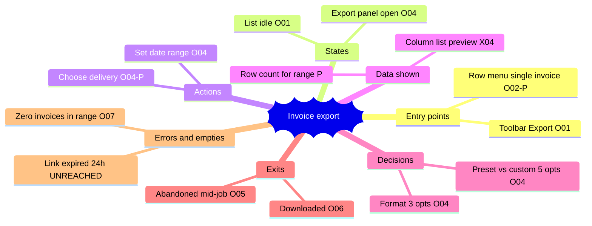
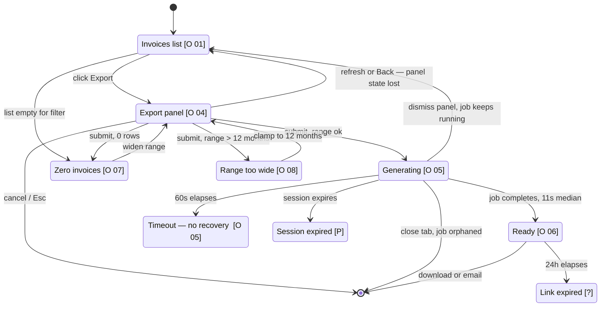

# Mind map and flow structure — the `map` command

A map is a document you leave behind. Someone reads it in a month with none of your context and must
be able to tell what the product does today, what you propose, and why that is worth building.
Everything below exists to keep those three separable on the page.

---

## 1. Trigger and output location

```
map [flow] --out <dir>
```

**Write into the folder the user named. Nowhere else.** A map dropped in the repo root is a file
nobody finds again, and the next person re-derives it from scratch.

| The user named | You write |
|---|---|
| A folder (`--out docs/billing/`) | `docs/billing/<flow-slug>-map.md` |
| A file (`--out docs/billing/export.md`) | exactly that file, replacing its contents |
| Nothing | **Ask once.** Do not guess. |

Slug in kebab from the flow name as the user says it: `invoice-export-map.md`, not
`InvoiceExport.md`. Split wireframes into `<flow-slug>-wireframes.md` only when they would make the
map unscannable — three or more screens, or any screen over 40 lines of ASCII. Below that keep them
inline; two thin files cost the reader a jump for nothing.

Failure behaviour:

- **Folder does not exist** — ask. Do not `mkdir -p` a tree the user did not sanction; a typo becomes
  `docs/biling/` and the real doc set silently never contains this map.
- **File of that name exists** — read it, say what it claims, ask whether to replace. Overwriting a
  map destroys the OBSERVED record it was built from.
- **Path unwritable or outside the repo** — report the exact path and error. Do not quietly relocate
  the output somewhere writable.

---

## 2. Precondition — you cannot map what you have not seen

The header's `status` field is not decoration. It is the precondition, made structural.

| Situation | Status | Requirement |
|---|---|---|
| Flow exists, you drove it this session | `OBSERVED` | Every node and state carries a screenshot reference |
| Flow does not exist yet | `PROPOSED` | The whole document is a design; no node may claim observation |
| Part exists, you are extending it | `MIXED` | Every node tagged individually (§7) |

**Mapping an existing flow requires a walkthrough first.** Run `walk` — see
[walkthrough.md](walkthrough.md) — and build the evidence ledger before writing a line of the map.
Reading the router tells you which routes are registered; it does not tell you the date field
silently resets when you switch tabs, and that is what a map is for.

Failure behaviour when you cannot walk it (app will not start, no credentials, feature flag): mark
the document `PROPOSED`, say in the header what you could not observe and why, tag every node `[P]`.
**Not legitimate:** mapping from source and labelling it `OBSERVED` — a fabricated observation is
worse than no map, because the reader trusts it precisely for looking specific. `PROPOSED` is a fine
thing to be; designing an unbuilt flow is the normal case for this command. The rule is only that
nobody mistakes it for a record.

---

## 3. The document skeleton

Fixed order, so a reader who has read one map can skim any other and a diff between two versions
stays readable.

```
1  Header            flow · date · status · audience · source screenshots
2  Mind map          the feature decomposed          (§4)
3  Flow structure    states and transitions          (§5)
4  How it should be structured                       (§6.1)  MANDATORY
5  How we reduce user effort                         (§6.2)  MANDATORY
6  Why it makes sense for the user                   (§6.3)  MANDATORY
7  Wireframes        grammar in wireframe.md
8  Open questions and risks
```

Sections 4–6 are the three the user asked for; a map missing any is not delivered. Sections 2 and 3
are the evidence they rest on; 7 and 8 stop a reader building the wrong thing from them.

```markdown
# Invoice export — flow map

status:     MIXED               (OBSERVED | PROPOSED | MIXED)
date:       2026-08-09
flow:       Export invoices from /billing/invoices
audience:   Finance ops, non-technical, ~6 exports/month each, 40 users
            (audience call and dwell time: audience.md)
observed:   screenshots 01–08, session 2026-08-09, Chrome 1440×900
not seen:   expired-download-link state — could not age a link inside the session
```

`not seen` is required whenever `status` is `OBSERVED` or `MIXED` and any part of the flow was
unreachable; without it, a gap in the map reads as an absence in the product. Wireframes use the
grammar in [wireframe.md](wireframe.md) — do not invent a second box-drawing dialect here.

---

## 4. The mind map

Two renderings, both required, because they serve readers who cannot see each other's output. The
**ASCII tree** survives a terminal, a `git diff`, a review comment and a plain text editor; the
**mermaid block** renders in GitHub, Obsidian and most markdown viewers and is what people paste
into a slide. Drop either and half the audience gets nothing. Generate the mermaid from the tree
rather than writing it twice — two hand-written maps drift within one edit.

### ASCII tree conventions

Box-drawing characters only: `├──`, `└──`, `│`, three-space continuation. No `-` or `*` bullets and
no tabs — tabs render at a different width in the viewer than in your editor and the tree shears.

Seven branches — `Entry points → States → Actions → Data shown → Decisions → Exits → Errors and
empties` — in that order, all seven always present. An empty branch gets a single `(none)` child,
because "no error states" is a finding and a missing branch is an oversight, and the reader cannot
tell those apart.

Tags sit in an aligned right-hand column; full vocabulary in §7. Decisions carry their option count
inline — `(5 options)` — because §6.2 needs it to compute the Decision component, and going back to
count later is where the number gets invented.

### Worked example — invoice export

```
Invoice export · /billing/invoices · MIXED
├── Entry points
│   ├── Toolbar button "Export"                      [O 01]
│   ├── Row menu → "Export this invoice"             [O→P 02]
│   └── Deep link /billing/export?range=last-month   [P]
├── States
│   ├── List idle, filters applied                   [O 01]
│   ├── Export panel open                            [O 04]
│   ├── Generating                                   [O 05]
│   ├── Ready — file available                       [O 06]
│   └── Panel dismissed, job still running           [O 06]
├── Actions
│   ├── Set date range (start + end fields)          [O 04]
│   ├── Pick format                                  [O 04]
│   ├── Choose delivery                              [O→P 04]
│   ├── Submit                                       [O 04]
│   └── Cancel a running job                         [P]
├── Data shown
│   ├── Column list preview (14 rows, always open)   [X 04]
│   ├── Row count for the chosen range               [P]
│   └── Estimated file size                          [P]
├── Decisions
│   ├── Preset range vs custom    (5 options)        [O 04]
│   ├── Format CSV / XLSX / PDF   (3 options)        [O 04]
│   └── Download now vs email me  (2 options)        [O→P 04]
├── Exits
│   ├── File downloaded                              [O 06]
│   ├── Emailed to the signed-in address             [O 06]
│   ├── Cancel — panel closes, filters kept          [O 04]
│   └── Abandonment — tab closed mid-generation      [O 05]
└── Errors and empties
    ├── Range yields zero invoices                   [O 07]
    ├── Range wider than 12 months — hard block      [O 08]
    ├── Generation timeout at 60s                    [O 05]
    ├── Download link expired after 24h              [?]
    └── Session expired mid-generation               [P]
```

Read that and three findings are visible before anyone opens the app: three entry points converge on
one panel that does not inherit the list's filters, the panel shows a 14-row column preview nobody
asked for while withholding the row count everyone wants, and one error state was never reachable.

### The mermaid rendering of the same map

Same seven branches, same order, **one line per ASCII leaf** — in the real document nothing is
dropped. The block below is cut to the first two leaves of each branch only to keep this reference
short; a map that ships a trimmed mermaid block while its ASCII tree is full is a defect, because
the two renderings are the same map for different readers.



Mermaid gotcha — the one that actually breaks these blocks: `[]`, `()`, `{}` and `""` are
**node-shape syntax** in `mindmap`, not text. `Toolbar Export [O 01]` renders an empty square node or
a parse error depending on viewer version. Write tags as bare trailing tokens (`O01`, `P`, `O04-P`,
`X04`, `UNREACHED`) and keep the bracket form in the ASCII tree, where it is safe. If a viewer still
chokes, fall back to `graph LR` with quoted labels — do not ship the tree alone.

---

## 5. The flow structure

A **state diagram, not a wireframe sequence**. A screen sequence says what a person sees when
everything works; a state diagram says what the system can be in, what moves it, and what happens
when it does not — which is where every real complaint lives.

Convention: `S1..Sn` normal states, `E1..En` errors and empties, `X1..Xn` exits. One line per
transition, indented under its source: `--trigger--> target`. Triggers are what the *human* did or
what happened *to* them — `--click Export-->`, `--60s elapses-->`, never
`--dispatch(EXPORT_REQUESTED)-->`; nobody reading this sees the reducer. Tag states as in §7.

```
S1  Invoices list, filters applied                                  [O 01]
      --click "Export" (toolbar)-------------------------> S2
      --row menu → "Export this invoice"------------------> S2
      --list is empty for the filter----------------------> E1
      --press E (shortcut)-------------------------------> S2          [P]

S2  Export panel open                                               [O 04]
      --submit, range ≤ 12 months-------------------------> S3
      --submit, range > 12 months-------------------------> E2
      --submit, 0 invoices in range-----------------------> E1
      --click Cancel / press Esc--------------------------> X3
      --refresh (F5)--------------------------------------> S1  panel state lost, filters kept
      --browser Back--------------------------------------> S1  panel state lost, filters kept

S3  Generating                                                      [O 05]
      --job completes (11s median, 312 rows)--------------> S4
      --60s elapses---------------------------------------> E3
      --dismiss panel-------------------------------------> S1  job continues, no indicator  [O 06]
      --close tab-----------------------------------------> X4  abandonment; job orphaned
      --session expires-----------------------------------> E5                               [P]

S4  Ready — file available                                          [O 06]
      --click Download------------------------------------> X1
      --delivery was "email me"---------------------------> X2
      --24h elapses, link clicked-------------------------> E4                               [?]

E1  Zero invoices in range          recover: widen range in place --> S2                      [O 07]
E2  Range wider than 12 months      recover: clamp to 12 months --> S2                        [O 08]
E3  Generation timeout              recover: NONE — panel shows "Try again later"             [O 05]
E4  Download link expired           recover: unknown, never reached                           [?]
E5  Session expired mid-generation  recover: re-auth returns to S1, job lost                  [P]

X1  Downloaded      X2  Emailed      X3  Cancelled      X4  Abandoned
```

E3 is the finding only a state diagram surfaces: a terminal error with no recovery edge. The user's
60 seconds are gone and the interface offers nothing but the same button.



Inside `stateDiagram-v2` the quoted `state "…" as S1` form **does** accept brackets, so tags survive
here. That difference from `mindmap` is a mermaid quirk, not a style choice.

### Completeness checklist

Run all nine. Any "no" is a finding for §6.1 or an open question for section 8 — never silence.

1. Does every state have at least one exit edge? Enter-and-cannot-leave is a trap.
2. Is every error recoverable **in place**, without redoing prior steps? E3 above is not.
3. Is every empty state drawn? Empty is a state, and the first one a new user sees.
4. Can the user leave and come back — is progress held, or silently discarded?
5. **Refresh (F5)** — what survives? Answer per state, not once for the flow.
6. **Back** — does it undo a step, leave the flow, or fire a "changes will be lost" dialog?
7. **Dead session** — after re-auth mid-flow, does the user land where they were?
8. Is abandonment drawn as an exit? People close tabs; a flow without that edge is happy-path only.
9. Does every long transition carry its measured duration? Over 400ms needs a number, because §6.2
   charges Wait for it — `doherty-threshold`, `replicated` (`scripts/why.py --name doherty-threshold`).

---

## 6. The three mandatory analysis sections

The user asked for these three by name. Format is fixed; content is yours.

### 6.1 How it should be structured

The proposal screen by screen with its reasoning attached. Not a list of tweaks — a statement of
what each screen is *for*, which is what makes it decidable whether an element belongs on it. Per
screen: purpose in one sentence, what it keeps/adds/hides/loses, the principle, and the scope class
from SKILL.md (`global` | `template-level` | `page-level`).

```markdown
#### Screen 1 — Invoices list  (page-level)

Purpose: find a set of invoices. Nothing else.

Keep      filter bar, table, toolbar Export
Move off  per-row Export — it opens the same heavy panel for one invoice, and users
          arriving that way still had to re-pick the invoice. Becomes a direct
          single-file download, no panel.                                      [O→P 02]
Principle jakobs-law [replicated] — a row action in every table they already use acts
          on that row immediately.

#### Screen 2 — Export panel  (page-level)

Purpose: confirm what is about to be exported, and start it.

Keep      format, delivery, submit
Add       row count and estimated size for the current range                       [P]
Inherit   the list's date filter as the panel's default range — it re-asked for a
          range the user had already set                                           [P]
Hide      column preview behind "Columns (14)" — today 14 always-open rows sitting
          above the submit button                                               [X 04]
Principle chunking [replicated] · conflicts: teslers-law — the complexity does not
          vanish, it moves into a disclosure the 5% who need it can open.
```

Failure behaviour: if a screen's purpose needs an "and", the screen is doing two jobs and that is
the finding. Write it as one rather than papering over it with a tidier layout.

### 6.2 How we reduce user effort

Before/after Human Cost Score, per step, components shown. Numbers, not adjectives: "much faster" is
unarguable, a table someone can dispute line by line is the point. The score is defined in
[effort-ledger.md](effort-ledger.md) and not redefined here. Produce the totals with
`python3 scripts/effort.py <ledger.csv>`, not by hand — hand sums drift between the table and the
summary line, and readers always spot it.

```markdown
Export a month of invoices — before (observed, shots 01–06) vs after (proposed)

| # | Step                                      | before I/D/M/W/R | Σ  | after I/D/M/W/R | Σ  |
|---|-------------------------------------------|------------------|----|-----------------|----|
| 1 | Reach Invoices from the dashboard         | 2/3/0/0/0        |  5 | 2/3/0/0/0       |  5 |
| 2 | Filter to the month                       | 4/2/1/1/1        |  9 | 4/2/1/1/1       |  9 |
| 3 | Open the panel — after: range inherited   | 1/0/1/0/0        |  2 | 1/0/0/0/0       |  1 |
| 4 | Re-enter the same date range in the panel | 6/2/2/0/1        | 11 | removed         |  0 |
| 5 | Choose format and delivery                | 1/2/0/0/0        |  3 | pre-selected    |  0 |
| 6 | Submit and wait — after: inline progress  | 1/0/0/3/0        |  4 | 1/0/0/1/0       |  2 |
| 7 | Fetch the file — after: link in the panel | 3/1/1/1/2        |  8 | 1/0/0/1/1       |  3 |
|   | **Total**                                 | **18/10/5/5/4**  |**42**| **9/5/1/3/2** |**20**|

before  HCS 42 (I:18 D:10 M:5 W:5 R:4)
after   HCS 20 (I:9  D:5  M:1 W:3 R:2)

Δ  I −9  range inherited, format remembered, link where the user is looking
   D −5  one choice point removed, one pre-answered
   M −4  nothing carried between list and panel
   W −2  progress shown, so 11s stops reading as a hang
   R −2  re-entry mistakes become impossible
   total −22 per export

frequency         40 finance users × 6 exports/month = 240/month = 2,880/year
frequency source  usage table 2026-Q2, supplied by the user 2026-08-09
annual            2,880 × 22 = 63,360 HCS units saved per year
```

Three rules, each with its failure behaviour:

- **HCS units are relative, not seconds.** The weights in `data/effort-weights.csv` are ratios.
  Converting to hours needs a measured seconds-per-unit constant this skill does not supply — say
  what would have to be measured. A fabricated "saves 340 hours a year" reaches the deck, and you
  get held to it.
- **No frequency source, no annual number.** Write `frequency: UNKNOWN — per-task saving only` and
  report −22. A guessed multiplier turns one soft assumption into a five-digit claim.
- **Report unchanged steps too.** Steps 1 and 2 save nothing and stay in the table. Listing only
  improved steps is a sales document; the reader needs to see the nav cost survive, because that is
  the next piece of work.

### 6.3 Why it makes sense for the user

Written from the user's point of view, in the user's vocabulary. **The test:** could you read this
aloud to the finance ops person who does this daily, and would they nod? If it only makes sense in
terms of components, state, endpoints or caching, it is not this section — it belongs in §6.1.

```markdown
Right now, exporting last month's invoices means telling the system the same thing
twice. You filter the list to March, then the export box opens and asks for the dates
again. Everyone gets this wrong at least once, and you find out when the file has the
wrong month in it and you have already emailed it on.

After this change the export box already knows you are looking at March. It tells you
"312 invoices, about 240 KB" before you press the button, so you can see it is the
right set, and it remembers you always pick XLSX. While it works you get a progress
bar instead of a frozen button, and the file appears in the box rather than behind the
bell icon in the corner.

Same job, four fewer things to hold in your head, and no way to export the wrong month
without seeing it first.
```

The version that fails the test, so you can spot it in your own draft:

```markdown
The export panel maintains an independent date-range state that is not hydrated from
the list's filter context. Lifting the filter into a shared provider lets the panel
derive its default range, eliminating redundant input and reducing interaction surface.
```

Every word of that is true and none of it belongs here: it describes what the code does, not what
the person stops having to do. If your draft contains "state", "context", "component", "hydrate",
"surface" or "flow", rewrite it as a sentence about the person's morning.

Keep the principle in the margin, not in the prose. This example rests on `millers-law` — grade
`contested` as applied to interface item counts, per §5.5 of
[/Users/shankhajeettaran/workspace/learning/research/laws-of-ux/00-overview-and-index.md](/Users/shankhajeettaran/workspace/learning/research/laws-of-ux/00-overview-and-index.md)
— plus `chunking` and `doherty-threshold`, both `replicated`. Quote the grade `why.py` returns, not
the one you remember; some grades in that CSV are deliberately unflattering.

---

## 7. Keeping it honest

A map blending what exists with what is imagined becomes a source of false confidence the moment
someone reads it a month later, because they cannot ask you which parts you saw. The tags are how
they find out without you.

| Tag | Means | Requires |
|---|---|---|
| `[O nn]` | Observed, in screenshot `nn` | A real screenshot in the evidence ledger |
| `[O→P nn]` | Exists today (shot `nn`), the proposal changes it | Both the observation and the change stated |
| `[X nn]` | Exists today (shot `nn`), the proposal removes it | Where the capability goes, or that it goes |
| `[P]` | Proposed; does not exist | Nothing observational may be claimed about it |
| `[?]` | Exists, but you could not reach it this session | An entry in section 8 saying why |

- **Tag every mind-map node and every state.** Untagged means the map is unfinished, not that the
  node is ordinary. Reviewers grep: `grep -c '\[P\]' map.md` should equal the number of things you
  are asking to have built.
- **`[?]` is not a weaker `[O]`.** If you never reached the expired-link state you do not know what
  it says, whether it offers a retry, or whether it exists. Tag it, list it in section 8, keep it out
  of §6.2 — a step you did not see cannot be scored.
- **Never promote a tag to tidy the document.** `[P]` stays `[P]` after the change ships, until
  someone re-walks the flow and re-tags it with a real screenshot number.
- **Header `status` must agree with the tags.** All `[O …]` → `OBSERVED`; all `[P]` → `PROPOSED`; any
  mixture → `MIXED`. `OBSERVED` over a tree containing `[P]` is the exact failure this section
  prevents.

Section 8 carries what tags cannot: states you could not reach and why, assumptions the proposal
rests on, the frequency source — anything a reviewer needs to disagree with you on evidence rather
than taste. An empty section 8 on a `MIXED` or `PROPOSED` map means you did not look hard enough; a
proposal with no risks is one nobody stress-tested.

---

## Stopping

One map per invocation. Produce it, write it to the named path, hand it over. Do not append an
unrequested implementation plan — turning findings into a structured proposal is
[brainstorm.md](brainstorm.md) — and do not re-walk your own map beyond the single confirming round
SKILL.md allows.
